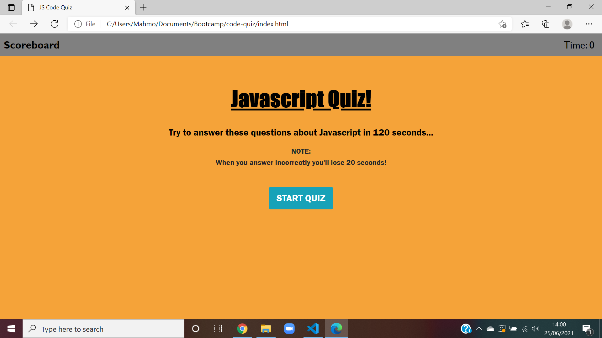
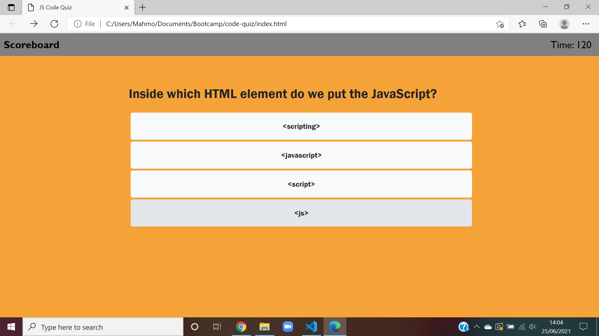
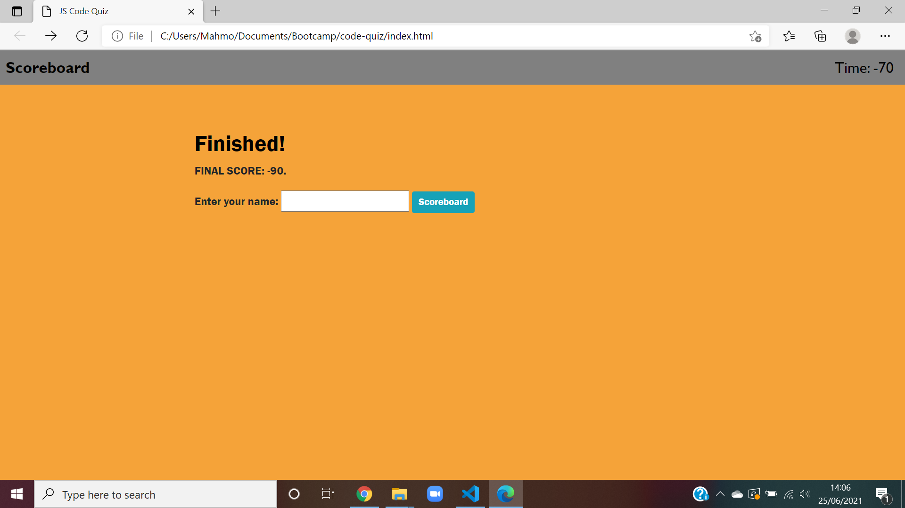

# Description
  In this homework assignment, I was tasked to build a timer based code quiz application with multiple-choice questions from scratch.

  # Quiz guide 
  * YOU will only have 120 seconds to answer 6 multipple choice questions.  
  * If you answer incorrectly you'll lose 20 seconds!
  * You will get points based on you answers.
  * You can't exit from the quiz while you are playing.

# Links
Repository Link: 

Deployed Link: 

# Screenshots
## Start page 

## Quiz page 

## Scoreboard page

# References and tutorials consulted
Data Flair: https://data-flair.training/blogs/javascript-quiz-questions/

W3schools: https://www.w3schools.com/js/js_quiz.asp

JavaScript Timing Events: https://www.w3schools.com/js/js_timing.asp